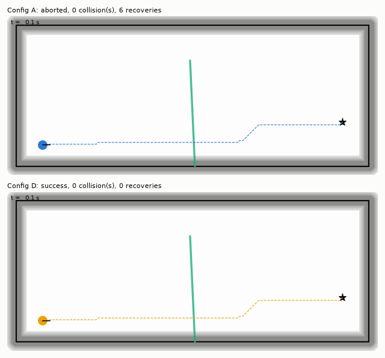
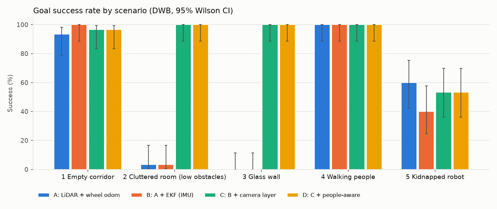

# CorridorCourier

**An indoor delivery robot that doesn't fail on the things LiDAR can't see.**

Indoor delivery robots in hospitals, warehouses and labs tend to fail for three reasons:

* **Blind spots.** Glass doors, low pallets and cart bodies sit outside the plane of a 2D LiDAR.
* **Dynamic obstacles.** People and carts move, and the robot freezes or clips them.
* **Drift.** Wheel odometry slips on polished floors and the robot loses its position.

This project asks one measurable question: *how much does adding camera perception and IMU fusion improve
navigation safety over a LiDAR-only Nav2 stack?* It answers with an ablation that has confidence intervals.



## Results

> Every number below comes from the **2D surrogate simulator** in `sim/`. It runs the *same C++ costmap
> code* as the Nav2 plugin and reproduces the failure modes above: pallets below the scan plane, specular glass,
> pedestrians, wheel slip and gyro bias. **It is not Gazebo.** The Gazebo harness in `src/cc_eval` runs the
> identical protocol and writes the same CSV. Quote robot results only after running it (see [Status](#status)).

1,200 navigation episodes: 5 worlds × 4 configs × 2 controllers (DWB, MPPI) × 30 fixed seeds. The seeds are
paired, so each seed builds the same world and pedestrians for every config. One set of Nav2 parameters is
used for all worlds and configs. Full tables, paired tests and figures are in **[docs/RESULTS.md](docs/RESULTS.md)**.

| DWB, worlds 1–4 pooled (120 runs per config) | Goal success [95% CI] | Collisions / run [95% CI] |
|---|---|---|
| A: LiDAR + wheel odometry | 49% [40, 58] | 1.21 [0.97, 1.45] |
| B: A + EKF (wheel + IMU) | 51% [42, 60] | 1.30 [1.06, 1.54] |
| C: B + camera costmap layer | 99% [95, 100] | 0.03 [0.01, 0.07] |
| D: C + people-aware inflation | 99% [95, 100] | 0.05 [0.01, 0.10] |

What the numbers say, including the parts that did not work:

1. **The camera costmap layer does the heavy lifting.** From A to D, collisions per run fell **96%**
   (1.21 → 0.05) and goal success rose from **49% to 99%**. The gain is concentrated where LiDAR is blind:
   * Cluttered room with pallets below the scan plane: success went from 3% to 100%.
   * Glass wall: success went from 0% to 100%.

   Both changes have a paired p below 1e-6. In the empty corridor (the control) and the walking-people world,
   A was already at 93–100% success, and the layer changed nothing there, as it should not. The pooled headline
   depends on which scenarios are in the mix. Two of the four were built to exercise LiDAR blind spots, so read
   the pooled number together with the per-world table.
2. **The EKF cut raw odometry drift by 78%** on a 20 m loop (1.19 m → 0.26 m, 30 seeds). The same study
   reproduced both pitfalls from the brief:
   * Untuned covariances (the diff-drive plugin's ~1e-9) give **no** gain.
   * An uncalibrated gyro makes fusion **worse** than wheels alone (1.99 m).

   The EKF made **no measurable difference to navigation or AMCL accuracy**, though. Median ATE was
   0.324 vs 0.322 m in the corridor and 0.036 vs 0.035 m in the room. Once AMCL has walls to match, it
   removes odometry drift. The one place odometry should matter is along a featureless corridor, and there
   AMCL occasionally loses its position (≈4 m off) in *every* config. That accounts for the 3–7% of
   empty-corridor failures. A better place to test the EKF is a longer or more degenerate corridor, or
   wheel slip at higher speed.
3. **People-aware inflation (D vs C) had no significant effect.** Minimum clearance, time within 0.5 m of a
   person, and contacts did not change (p ≥ 0.2), and with MPPI it cost 3.4 s per run (p = 0.002). In a 4 m
   corridor with pedestrians who hold their lane, a wider static cost bubble cannot buy distance. The likely
   fix is velocity-aware costs (predicting where a person will be), not a bigger radius. That is the next
   experiment, not a claim.
4. **DWB and MPPI performed about the same on safety.** MPPI was 3–5 s slower per run and used about 30%
   more CPU in this implementation.
5. **Kidnapped-robot recovery works about half the time** (43–60% re-localized). The failures are real
   ambiguity in a self-similar office loop. Sometimes the monitor never fires because the wrong pose still
   matches the map well; sometimes global re-localization converges to a look-alike spot.
6. **Perception budget.** YOLOv8n ONNX on CPU runs in 77 ms median per frame (inference, NMS and depth
   projection), about 13 Hz on this machine. The C++ layer update takes about 0.2 ms per cycle.



## Architecture (ROS 2 Jazzy + Gazebo Harmonic)

| Package | What it contains |
|---|---|
| `cc_description` | URDF/xacro. 2D LiDAR at 0.18 m, RGB-D camera at 0.45 m pitched 15° down, IMU, diff drive, ground-truth publisher |
| `cc_gazebo` | 5 SDF worlds **generated from the same definitions as the simulator**, `ros_gz_bridge` config, sim launch |
| `cc_localization` | `robot_localization` EKF (wheel twist + gyro), covariance relay with gyro-bias calibration, slam_toolbox, AMCL, kidnap monitor |
| `cc_perception` | YOLO ONNX detector, depth → 3D projection (ground-plane fallback for glass), ground-truth "oracle" backend |
| `cc_costmap_layers` | **C++ Nav2 layer**: class-aware inflation, persistence, association, thread-safe; ROS-free core + C API |
| `cc_navigation` | Shared Nav2 params plus per-config overlays, DWB and MPPI, Smac 2D, behavior tree, twist_mux |
| `cc_eval` | Episode harness (rosbag, TUM files for `evo`), metrics, paired statistics, report and plots |
| `sim/` | The 2D surrogate simulator that produced the results above |

The design rationale is in **[docs/ARCHITECTURE.md](docs/ARCHITECTURE.md)**: why each covariance, why AMCL
injection is off, how the layer stays thread-safe, and why DWB vs MPPI.
Acceptance tests for each milestone are in **[docs/MILESTONES.md](docs/MILESTONES.md)**.

## Run it

**Without ROS** (any Linux or macOS with Python 3.10+ and g++):

```bash
make setup           # numpy scipy matplotlib pillow pytest onnxruntime opencv
make test            # C++ layer core + simulator + metrics + perception tests
make results         # drift study + full ablation (~35 min on 4 cores) + demo GIFs + docs/RESULTS.md
make results SEEDS=5 # quick look (~6 min)
make latency         # YOLOv8n ONNX benchmark (needs `pip install ultralytics` to export the model)
```

**With ROS 2 Jazzy + Gazebo Harmonic** (native, or `make docker && make docker-run`):

```bash
colcon build --symlink-install && source install/setup.bash
ros2 launch cc_navigation bringup.launch.py world:=glass_wall ablation:=D controller:=dwb rviz:=true
ros2 run cc_eval harness --ros-args -p use_sim_time:=true -p world:=glass_wall -p config:=D   # one episode
ros2 run cc_eval run_ablation --seeds 30 --controllers dwb,mppi --bags                       # the full study
```

`detector:=oracle` (the default) feeds the costmap layer ground-truth objects with realistic recall, noise and
latency, so the pipeline runs without a trained model. `detector:=onnx model_path:=...` runs the real
detector. Stock COCO weights only know "person"; carts, pallets and glass need a fine-tuned model with the
classes `[person, cart, low_obstacle, glass]`.

## Status

| Milestone | Surrogate (this repo, run) | Gazebo (code ready, not run here) |
|---|---|---|
| 1 Robot + world, clean TF tree | – | `view_frames` |
| 2 Sensor sanity, frame timing | – | `ros2 run cc_eval sensor_sanity` |
| 3 EKF drift, with and without IMU | ✔ 1.19 → 0.26 m | `ros2 run cc_eval drift_test` |
| 4 SLAM + AMCL vs ground truth | ✔ AMCL ATE and kidnap | slam_toolbox mapping pass |
| 5 Nav2 baseline + harness | ✔ | `run_ablation --configs A` |
| 6 Perception + costmap layer | ✔ (same C++ core) | `bringup.launch.py ablation:=D` |
| 7 Ablation, writeup, demo | ✔ RESULTS.md, GIFs | `run_ablation`, screen recording |

This was built in a container without ROS or Gazebo: the ROS package index is blocked there. The ROS packages
are complete but **have not been compiled or launched yet**. The first `colcon build` may surface small API
mismatches. The `ros` job in `.github/workflows/ci.yml` builds and tests the workspace in the official
`osrf/ros:jazzy-desktop` image. Everything else (C++ core, simulator, metrics, perception math, ONNX
decoding) is tested and runs here. The ONNX decoder was checked box-for-box against Ultralytics' own output.

## Resume bullet

Based on the surrogate results (swap in the Gazebo numbers once you have them, and be ready to explain the
difference):

> Built a ROS 2/Nav2 indoor delivery stack with a custom thread-safe C++ costmap layer that fuses RGB-D
> detections (YOLO + depth) with class-aware inflation. Across 240 paired simulated runs it cut collisions
> by 96% and raised goal success from 49% to 99%. A wheel+IMU EKF reduced 20 m odometry drift by 78%. The
> evaluation harness (30 fixed seeds × 5 scenarios × 4 ablation configs, Wilson/bootstrap CIs, paired tests)
> also showed that larger social inflation alone did not increase clearance to pedestrians.

The last sentence is optional, but interviewers tend to value a measured negative result more than a
perfect-looking table.

## License

Apache-2.0
