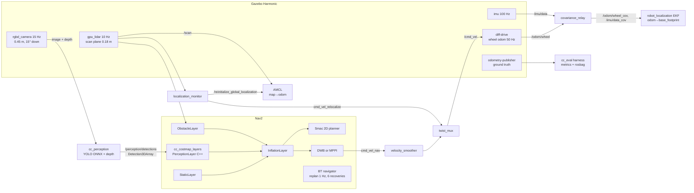

# Architecture and design decisions

This file explains the design and the reason behind each choice. Those reasons are what an interviewer
will probe. Each decision points to the result that backs it up. The results are in [RESULTS.md](RESULTS.md).

## Data flow

The TF tree is `map → odom → base_footprint → base_link → {lidar_link, imu_link, camera_link → camera_optical_frame, wheels}`.
There is exactly one publisher per edge. `map→odom` comes from AMCL, or from slam_toolbox while mapping.
`odom→base_footprint` comes from the EKF (configs B–D) or from the gz diff-drive plugin (config A only;
`sim.launch.py wheel_tf:=true`). Ground truth is published in a separate `world` frame and never enters TF,
so the stack cannot cheat.

## Ablation configs

| Config | Odometry | Costmap layers | People |
|---|---|---|---|
| A | wheel encoders (gz diff-drive TF) | static + LiDAR obstacle + inflation | as LiDAR sees them |
| B | EKF: wheel twist + gyro yaw rate | same as A | same as A |
| C | same as B | + `PerceptionLayer` | inflated like any object (0.55 m) |
| D | same as B | + `PerceptionLayer` | people-aware: 1.2 m, softer decay |

Configs differ only by overlay YAMLs (`cc_navigation/config/costmaps_*.yaml`). Every other Nav2
parameter is shared by all worlds and configs. Tuning per scenario would invalidate the comparison.
The simulator's DWB/MPPI weights were tuned once, on the empty-corridor control world only.

## Why these choices

### EKF: fuse velocities and distrust wheel yaw rate
* **Velocities, not poses.** Wheel odometry and the gyro both drift in absolute yaw, and they drift
  differently. Fusing two absolute yaws makes the filter jump between them. Fusing `vx` and `vyaw`
  and integrating inside the filter avoids that.
* **Wheel `vyaw` σ = 0.08 rad/s, gyro σ = 0.005 rad/s.** On a polished floor the wheels scrub in
  turns. The encoders over-report rotation by a few percent and slip in bursts. The gyro does not slip.
  Tuned this way, 20 m-loop drift falls by about 78%.
* **The two pitfalls, measured.** The Gazebo diff-drive plugin publishes a twist covariance of about 1e-9.
  Left untouched, the EKF trusts the slipping wheels and fusion buys nothing ("untuned" row). With an
  uncalibrated gyro (bias ~0.5°/s) the tuned weights make the result worse than wheels alone. That is
  why `covariance_relay` estimates the gyro bias during a 2 s standstill at start-up. See the drift table.
* **No gyro-bias state.** robot_localization has none, so the simulator doesn't model one either. The
  bias has to be removed before the filter sees the data.

### AMCL: injection off, kidnap handled by a monitor
* In a 30 m corridor, position along the corridor is unobservable once both end walls are out of the 8 m
  LiDAR range. With Nav2's recovery alphas on, randomly injected particles have the right *y* and yaw but
  the wrong *x*. They score just as well, and in development they took over the estimate: a 2.7 m jump
  mid-corridor. So injection stays off (Nav2's default).
* Kidnapping is detected from the scan-to-map match ratio: the fraction of beams whose endpoint lies within
  0.2 m of a mapped wall. Below 0.35 for 3 s (normal operation stays at 0.49 or above), the monitor
  re-initializes AMCL globally and spins the robot until the match recovers.
* Estimates come from the heaviest particle cluster, not a single best particle, as in AMCL itself.

### The perception layer (C++)
* **Class-specific inflation.** A person's cost reaches zero at 1.2 m from their surface, with scaling
  1.5. Objects use 0.55 m and 3.0, the same as the standard inflation layer. A larger radius *with a
  gentler decay* makes the planner prefer social distance, but a person never makes a 3–4 m corridor
  impassable.
* **Class-specific persistence and confirmation.** People are forgotten after 0.5 s, so moving people
  leave no ghost trail. Pallets are kept 10 s, carts 5 s and glass 20 s, because the camera's narrow
  field of view loses them as the robot turns. Static classes need 2 hits before they are marked, which
  suppresses single-frame false positives (the simulator injects 0.03 per frame).
* **Association.** Repeated detections of the same object merge. Positions average with a capped weight
  so a mis-association can still be corrected. This keeps the object count flat instead of growing
  every frame.
* **Glass geometry.** Depth is invalid on glass. The node then intersects the bottom edge of the
  bounding box with the floor plane, and the layer stamps an oriented thin box (the visible pane)
  rather than a point.
* **Thread safety.** The detection callback runs on the executor thread; `updateBounds`/`updateCosts` run on
  the costmap update thread. Every access to the model is behind a mutex. The callback converts a whole
  message *before* taking the lock, so the lock is held only for the insert.
* **Clearing.** `updateBounds` returns the union of this cycle's and last cycle's footprints. Nav2 resets
  that window before the layers write, so cells of vanished objects are cleared.
* **Latency.** Detections keep the *capture* stamp, and the layer transforms them with TF at that time.
  A detection 100 ms old is placed where the object was when the frame was taken, not where the robot is now.
* **One implementation.** `cost_model.cpp` has no ROS dependency. The plugin wraps it, and the simulator
  loads the same file through a C API (`ctypes`). The ablation therefore measures the code that ships.

### Planner and controllers
* **Smac 2D** on a 0.10 m downsampled grid with `cost_travel_multiplier = 3`. Paths keep away from
  inflated cost rather than hugging it. The simulator's A* uses the same cost term.
* **DWB vs MPPI.** DWB samples constant (v, ω) arcs for 1.5 s and hard-rejects any arc that touches
  inscribed cost. MPPI samples 400 noisy 2 s control sequences and averages them with softmax weights.
  Collision is a large cost, not a veto, so it moves smoothly through gaps but can come closer to
  obstacles. The trade-off is measured in the DWB vs MPPI table.
* **Escaping from inscribed cost.** If the robot already sits in a lethal or inscribed cell (a person
  stepped close, or after a bump), both controllers accept only trajectories that do not raise the cost.
  Without that rule the robot freezes, and a pedestrian walks into it.

## Simulator scope (what is and is not modelled)
Modelled: LiDAR scan plane and height, cart legs vs body, specular glass (return probability
0.8·exp(−(θ/10°)²)), camera FOV, range-dependent recall, depth noise (σ = 0.03 + 0.01 z²),
occlusion by walls, the floor blind zone of the pitched camera, 100 ms latency, false positives,
per-run encoder calibration error, slip bursts, gyro bias and noise, acceleration limits, hard contacts.
Pedestrians walk their lanes, never sidestep, and pause if the robot blocks them.

Not modelled: robot dynamics beyond a unicycle with acceleration limits, 3D sensor artifacts, rendering,
real detector failure modes (look-alikes, lighting), timing jitter, and SLAM (the simulator uses the map a
perfect LiDAR SLAM pass on the *empty* world would produce: walls only, no glass).
