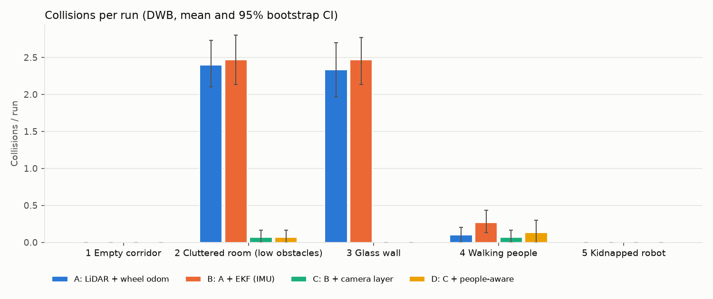
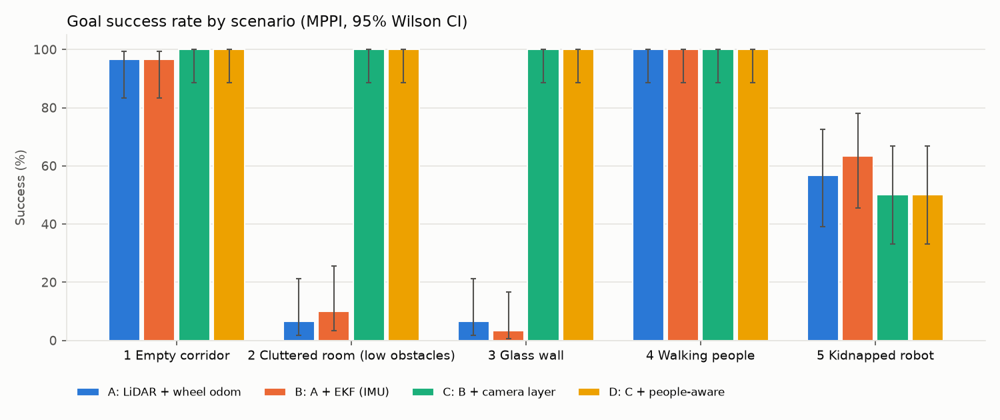
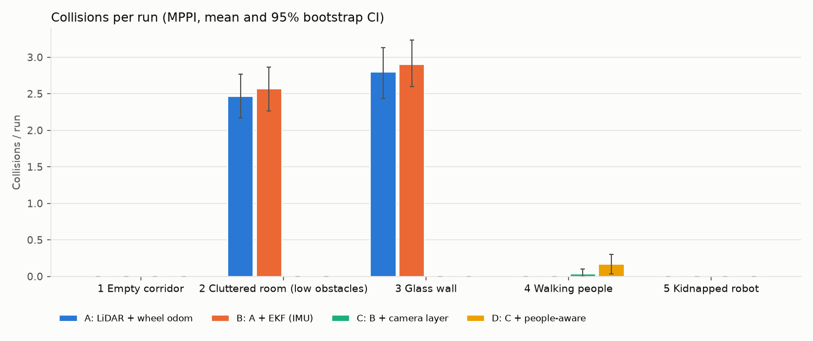
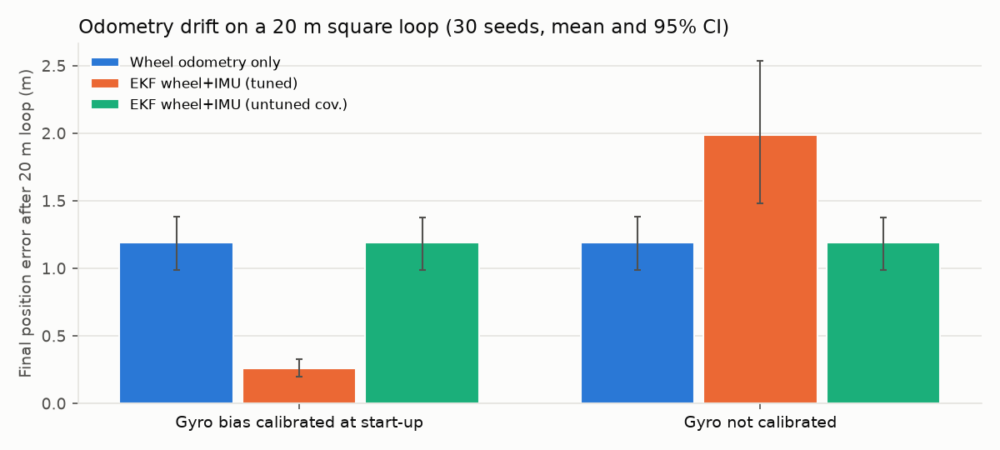

# Results

> **Where these numbers come from.** Every figure below was produced by the 2D surrogate simulator in `sim/` (`make results`), not by Gazebo. The surrogate runs the same C++ costmap core as the Nav2 plugin and models the specific failure modes under study (objects below the LiDAR plane, specular glass, pedestrians, wheel slip, gyro bias), but it is a simplified world: treat the numbers as evidence about the *mechanisms*, and re-run the identical protocol in Gazebo (`ros2 run cc_eval run_ablation`) before quoting them as robot results. The CSV schema and this report generator are shared, so the Gazebo run produces the same tables.

Protocol: 1200 episodes = 5 worlds × 4 configs × 2 controllers × 30 fixed seeds. Seeds are shared across configs (paired design): seed *k* builds the same world, clutter and pedestrians for every config. Nav2-equivalent parameters are identical in every world and config. Intervals are 95% (Wilson for rates, percentile bootstrap for means/medians).

## Headline (controller: DWB, worlds 1–4 pooled)

| Config | Goal success | Collisions / run | Min. clearance to people (m) | Time within 0.5 m of people (s) | Recoveries / run |
|---|---|---|---|---|---|
| A: LiDAR + wheel odom | 49 [40, 58] % | 1.21 [0.97, 1.45] | 0.07 [0.04, 0.11] | 15.18 [11.24, 19.67] | 3.13 [2.62, 3.64] |
| B: A + EKF (IMU) | 51 [42, 60] % | 1.30 [1.06, 1.54] | 0.07 [0.03, 0.11] | 18.85 [13.64, 24.66] | 3.19 [2.67, 3.70] |
| C: B + camera layer | 99 [95, 100] % | 0.03 [0.01, 0.07] | 0.08 [0.04, 0.12] | 15.13 [10.71, 20.62] | 0.28 [0.12, 0.46] |
| D: C + people-aware | 99 [95, 100] % | 0.05 [0.01, 0.10] | 0.10 [0.03, 0.18] | 14.50 [11.06, 18.19] | 0.20 [0.07, 0.38] |

* Collisions per run fell from **1.21 (A) to 0.05 (D)**, a **96%** reduction.
* Goal success rose from **49% to 99%** (120 paired runs per config).
* The tuned EKF cut 20 m-loop odometry drift from **1.19 m to 0.26 m (78% less)**.

## Per-scenario results — DWB controller

| World | Config | Success % [CI] | Collisions/run [CI] | Min clearance people (m) | Time to goal (s) | Path length (m) | ATE median (m) | Recoveries/run | Nav CPU ms/cycle |
|---|---|---|---|---|---|---|---|---|---|
| 1 Empty corridor | A | 93 [79, 98] | 0.00 [0.00, 0.00] | – | 55.4 | 26.9 | 0.324 | 0.53 | 6.0 |
| 1 Empty corridor | B | 100 [89, 100] | 0.00 [0.00, 0.00] | – | 56.7 | 26.9 | 0.322 | 0.47 | 6.1 |
| 1 Empty corridor | C | 97 [83, 99] | 0.00 [0.00, 0.00] | – | 55.2 | 26.9 | 0.278 | 0.27 | 5.9 |
| 1 Empty corridor | D | 97 [83, 99] | 0.00 [0.00, 0.00] | – | 55.2 | 26.9 | 0.278 | 0.27 | 6.0 |
| 2 Cluttered room (low obstacles) | A | 3 [1, 17] | 2.40 [2.10, 2.73] | – | 27.0 | 12.9 | 0.036 | 5.80 | 5.3 |
| 2 Cluttered room (low obstacles) | B | 3 [1, 17] | 2.47 [2.13, 2.80] | – | 27.0 | 12.9 | 0.035 | 5.80 | 5.0 |
| 2 Cluttered room (low obstacles) | C | 100 [89, 100] | 0.07 [0.00, 0.17] | – | 36.1 | 14.5 | 0.038 | 0.40 | 6.4 |
| 2 Cluttered room (low obstacles) | D | 100 [89, 100] | 0.07 [0.00, 0.17] | – | 36.1 | 14.5 | 0.038 | 0.40 | 6.5 |
| 3 Glass wall | A | 0 [0, 11] | 2.33 [1.97, 2.70] | – | – | – | 0.047 | 6.00 | 5.7 |
| 3 Glass wall | B | 0 [0, 11] | 2.47 [2.13, 2.77] | – | – | – | 0.048 | 6.00 | 5.9 |
| 3 Glass wall | C | 100 [89, 100] | 0.00 [0.00, 0.00] | – | 45.8 | 21.5 | 0.051 | 0.10 | 7.6 |
| 3 Glass wall | D | 100 [89, 100] | 0.00 [0.00, 0.00] | – | 45.8 | 21.5 | 0.051 | 0.10 | 7.5 |
| 4 Walking people | A | 100 [89, 100] | 0.10 [0.00, 0.20] | 0.07 [0.04, 0.11] | 60.6 | 27.5 | 0.202 | 0.20 | 5.3 |
| 4 Walking people | B | 100 [89, 100] | 0.27 [0.13, 0.43] | 0.07 [0.03, 0.11] | 63.9 | 27.4 | 0.249 | 0.50 | 5.5 |
| 4 Walking people | C | 100 [89, 100] | 0.07 [0.00, 0.17] | 0.08 [0.04, 0.12] | 62.1 | 27.5 | 0.277 | 0.33 | 5.5 |
| 4 Walking people | D | 100 [89, 100] | 0.13 [0.00, 0.30] | 0.10 [0.03, 0.18] | 61.9 | 28.0 | 0.274 | 0.03 | 5.8 |
| 5 Kidnapped robot | A | 60 [42, 75] | 0.00 [0.00, 0.00] | – | 45.6 | 16.3 | 4.745 | 1.73 | 26.3 |
| 5 Kidnapped robot | B | 40 [25, 58] | 0.00 [0.00, 0.00] | – | 38.5 | 14.8 | 7.057 | 1.90 | 25.7 |
| 5 Kidnapped robot | C | 53 [36, 70] | 0.00 [0.00, 0.00] | – | 44.3 | 17.8 | 4.748 | 1.93 | 26.2 |
| 5 Kidnapped robot | D | 53 [36, 70] | 0.00 [0.00, 0.00] | – | 44.3 | 17.8 | 4.748 | 1.93 | 25.8 |

Paired tests against config A (DWB): exact McNemar on success, Wilcoxon signed-rank on collisions.

| World | Config | Δ success (pp) | p (success) | Δ collisions/run | p (collisions) |
|---|---|---|---|---|---|
| 1 Empty corridor | B | +7 | 0.5 | +0.00 | 1 |
| 1 Empty corridor | C | +3 | 1 | +0.00 | 1 |
| 1 Empty corridor | D | +3 | 1 | +0.00 | 1 |
| 2 Cluttered room (low obstacles) | B | +0 | 1 | +0.07 | 0.74 |
| 2 Cluttered room (low obstacles) | C | +97 | 3.73e-09 | -2.33 | 6.3e-07 |
| 2 Cluttered room (low obstacles) | D | +97 | 3.73e-09 | -2.33 | 6.3e-07 |
| 3 Glass wall | B | +0 | 1 | +0.13 | 0.689 |
| 3 Glass wall | C | +100 | 1.86e-09 | -2.33 | 1.31e-06 |
| 3 Glass wall | D | +100 | 1.86e-09 | -2.33 | 1.31e-06 |
| 4 Walking people | B | +0 | 1 | +0.17 | 0.162 |
| 4 Walking people | C | +0 | 1 | -0.03 | 0.756 |
| 4 Walking people | D | +0 | 1 | +0.03 | 0.974 |
| 5 Kidnapped robot | B | -20 | 0.18 | +0.00 | 1 |
| 5 Kidnapped robot | C | -7 | 0.791 | +0.00 | 1 |
| 5 Kidnapped robot | D | -7 | 0.791 | +0.00 | 1 |

## Per-scenario results — MPPI controller

| World | Config | Success % [CI] | Collisions/run [CI] | Min clearance people (m) | Time to goal (s) | Path length (m) | ATE median (m) | Recoveries/run | Nav CPU ms/cycle |
|---|---|---|---|---|---|---|---|---|---|
| 1 Empty corridor | A | 97 [83, 99] | 0.00 [0.00, 0.00] | – | 60.2 | 27.0 | 0.336 | 0.20 | 7.1 |
| 1 Empty corridor | B | 97 [83, 99] | 0.00 [0.00, 0.00] | – | 63.1 | 27.1 | 0.324 | 0.93 | 7.3 |
| 1 Empty corridor | C | 100 [89, 100] | 0.00 [0.00, 0.00] | – | 61.2 | 27.1 | 0.325 | 0.20 | 7.2 |
| 1 Empty corridor | D | 100 [89, 100] | 0.00 [0.00, 0.00] | – | 61.2 | 27.1 | 0.325 | 0.20 | 6.9 |
| 2 Cluttered room (low obstacles) | A | 7 [2, 21] | 2.47 [2.17, 2.77] | – | 65.5 | 13.8 | 0.036 | 5.77 | 6.9 |
| 2 Cluttered room (low obstacles) | B | 10 [3, 26] | 2.57 [2.27, 2.87] | – | 77.3 | 13.7 | 0.036 | 5.80 | 6.5 |
| 2 Cluttered room (low obstacles) | C | 100 [89, 100] | 0.00 [0.00, 0.00] | – | 34.4 | 14.7 | 0.034 | 0.00 | 8.1 |
| 2 Cluttered room (low obstacles) | D | 100 [89, 100] | 0.00 [0.00, 0.00] | – | 34.4 | 14.7 | 0.034 | 0.00 | 7.9 |
| 3 Glass wall | A | 7 [2, 21] | 2.80 [2.43, 3.13] | – | 55.3 | 19.6 | 0.042 | 5.67 | 7.6 |
| 3 Glass wall | B | 3 [1, 17] | 2.90 [2.60, 3.23] | – | 64.6 | 18.8 | 0.044 | 5.83 | 7.5 |
| 3 Glass wall | C | 100 [89, 100] | 0.00 [0.00, 0.00] | – | 50.0 | 21.9 | 0.048 | 0.03 | 9.4 |
| 3 Glass wall | D | 100 [89, 100] | 0.00 [0.00, 0.00] | – | 50.0 | 21.9 | 0.048 | 0.03 | 9.2 |
| 4 Walking people | A | 100 [89, 100] | 0.00 [0.00, 0.00] | 0.10 [0.07, 0.13] | 64.0 | 28.1 | 0.240 | 0.00 | 8.0 |
| 4 Walking people | B | 100 [89, 100] | 0.00 [0.00, 0.00] | 0.10 [0.08, 0.13] | 63.4 | 28.0 | 0.225 | 0.00 | 8.2 |
| 4 Walking people | C | 100 [89, 100] | 0.03 [0.00, 0.10] | 0.10 [0.06, 0.14] | 64.1 | 28.1 | 0.283 | 0.07 | 8.2 |
| 4 Walking people | D | 100 [89, 100] | 0.17 [0.03, 0.30] | 0.10 [0.05, 0.16] | 67.6 | 28.8 | 0.205 | 0.03 | 8.6 |
| 5 Kidnapped robot | A | 57 [39, 73] | 0.00 [0.00, 0.00] | – | 38.6 | 15.0 | 4.335 | 1.20 | 27.5 |
| 5 Kidnapped robot | B | 63 [46, 78] | 0.00 [0.00, 0.00] | – | 41.3 | 16.2 | 3.736 | 1.17 | 28.6 |
| 5 Kidnapped robot | C | 50 [33, 67] | 0.00 [0.00, 0.00] | – | 44.0 | 17.6 | 5.642 | 1.40 | 30.2 |
| 5 Kidnapped robot | D | 50 [33, 67] | 0.00 [0.00, 0.00] | – | 44.0 | 17.6 | 5.642 | 1.40 | 30.0 |

Paired tests against config A (MPPI): exact McNemar on success, Wilcoxon signed-rank on collisions.

| World | Config | Δ success (pp) | p (success) | Δ collisions/run | p (collisions) |
|---|---|---|---|---|---|
| 1 Empty corridor | B | +0 | 1 | +0.00 | 1 |
| 1 Empty corridor | C | +3 | 1 | +0.00 | 1 |
| 1 Empty corridor | D | +3 | 1 | +0.00 | 1 |
| 2 Cluttered room (low obstacles) | B | +3 | 1 | +0.10 | 0.377 |
| 2 Cluttered room (low obstacles) | C | +93 | 7.45e-09 | -2.47 | 6.86e-07 |
| 2 Cluttered room (low obstacles) | D | +93 | 7.45e-09 | -2.47 | 6.86e-07 |
| 3 Glass wall | B | -3 | 1 | +0.10 | 0.582 |
| 3 Glass wall | C | +93 | 7.45e-09 | -2.80 | 1.41e-06 |
| 3 Glass wall | D | +93 | 7.45e-09 | -2.80 | 1.41e-06 |
| 4 Walking people | B | +0 | 1 | +0.00 | 1 |
| 4 Walking people | C | +0 | 1 | +0.03 | 0.728 |
| 4 Walking people | D | +0 | 1 | +0.17 | 0.121 |
| 5 Kidnapped robot | B | +7 | 0.688 | +0.00 | 1 |
| 5 Kidnapped robot | C | -7 | 0.774 | +0.00 | 1 |
| 5 Kidnapped robot | D | -7 | 0.774 | +0.00 | 1 |

## DWB vs MPPI (same configs, same seeds, worlds 1–4 pooled)

| Config | Controller | Success % | Collisions/run | Min clearance people (m) | Time to goal (s) | Nav CPU ms/cycle |
|---|---|---|---|---|---|---|
| A | DWB | 49 [40, 58] | 1.21 [0.97, 1.45] | 0.07 [0.04, 0.11] | 57.5 [55.6, 59.4] | 5.5 |
| A | MPPI | 52 [44, 61] | 1.32 [1.06, 1.57] | 0.10 [0.07, 0.13] | 62.0 [60.3, 63.8] | 7.4 |
| B | DWB | 51 [42, 60] | 1.30 [1.06, 1.54] | 0.07 [0.03, 0.11] | 59.8 [57.1, 62.8] | 5.6 |
| B | MPPI | 52 [44, 61] | 1.37 [1.10, 1.63] | 0.10 [0.08, 0.13] | 63.9 [61.9, 66.4] | 7.4 |
| C | DWB | 99 [95, 100] | 0.03 [0.01, 0.07] | 0.08 [0.04, 0.12] | 49.8 [47.4, 52.3] | 6.3 |
| C | MPPI | 100 [97, 100] | 0.01 [0.00, 0.03] | 0.10 [0.06, 0.14] | 52.4 [50.3, 54.6] | 8.2 |
| D | DWB | 99 [95, 100] | 0.05 [0.01, 0.10] | 0.10 [0.03, 0.18] | 49.7 [47.4, 52.1] | 6.5 |
| D | MPPI | 100 [97, 100] | 0.04 [0.01, 0.08] | 0.10 [0.05, 0.16] | 53.3 [51.0, 55.7] | 8.2 |

## People-aware inflation (D vs C, walking-people world)

Paired by seed, Wilcoxon signed-rank. *Time within 0.5 m* is the total time the robot's surface was within 0.5 m of a person's; it was added after the first full run because the minimum clearance (a single worst moment per run) turned out to be too noisy to separate C from D.

| Controller | Metric | C | D | p |
|---|---|---|---|---|
| DWB | Min. clearance (m), mean | 0.08 | 0.10 | 0.262 |
| DWB | Time within 0.5 m (s), mean | 15.13 | 14.50 | 0.612 |
| DWB | Person contacts / run | 0.07 | 0.13 | 0.74 |
| DWB | Time to goal (s) | 62.14 | 61.92 | 0.221 |
| MPPI | Min. clearance (m), mean | 0.10 | 0.10 | 0.805 |
| MPPI | Time within 0.5 m (s), mean | 13.09 | 14.78 | 0.205 |
| MPPI | Person contacts / run | 0.03 | 0.17 | 0.227 |
| MPPI | Time to goal (s) | 64.14 | 67.58 | 0.00154 |

## Localization (milestone 4) and kidnapped-robot recovery

ATE = RMSE between the AMCL pose (map frame) and ground truth over the whole episode, equivalent to `evo_ape` without alignment.

| World | Config | ATE median (m) [CI] | Re-localized after kidnap | Median time to re-localize (s) |
|---|---|---|---|---|
| 1 Empty corridor | A | 0.324 [0.261, 0.431] | – | – |
| 1 Empty corridor | B | 0.322 [0.263, 0.412] | – | – |
| 1 Empty corridor | C | 0.278 [0.210, 0.385] | – | – |
| 1 Empty corridor | D | 0.278 [0.210, 0.385] | – | – |
| 2 Cluttered room (low obstacles) | A | 0.036 [0.031, 0.039] | – | – |
| 2 Cluttered room (low obstacles) | B | 0.035 [0.032, 0.040] | – | – |
| 2 Cluttered room (low obstacles) | C | 0.038 [0.035, 0.041] | – | – |
| 2 Cluttered room (low obstacles) | D | 0.038 [0.035, 0.041] | – | – |
| 3 Glass wall | A | 0.047 [0.044, 0.051] | – | – |
| 3 Glass wall | B | 0.048 [0.046, 0.059] | – | – |
| 3 Glass wall | C | 0.051 [0.048, 0.054] | – | – |
| 3 Glass wall | D | 0.051 [0.048, 0.054] | – | – |
| 4 Walking people | A | 0.202 [0.142, 0.263] | – | – |
| 4 Walking people | B | 0.249 [0.187, 0.316] | – | – |
| 4 Walking people | C | 0.277 [0.197, 0.389] | – | – |
| 4 Walking people | D | 0.274 [0.198, 0.376] | – | – |
| 5 Kidnapped robot | A | 4.745 [3.755, 6.876] | 60 [42, 75] % | 8.7 |
| 5 Kidnapped robot | B | 7.057 [4.682, 7.579] | 43 [27, 61] % | 3.7 |
| 5 Kidnapped robot | C | 4.748 [3.566, 6.534] | 57 [39, 73] % | 11.7 |
| 5 Kidnapped robot | D | 4.748 [3.566, 6.534] | 57 [39, 73] % | 11.7 |

## EKF drift on a 20 m loop (milestone 3)

| Gyro | Estimator | Final position error (m) [CI] | Max error (m) | Final yaw error (°) | Drift (% of distance) |
|---|---|---|---|---|---|
| calibrated | wheel_only | 1.192 [0.989, 1.382] | 1.245 | 19.57 | 5.96 |
| calibrated | ekf_wheel_imu_tuned | 0.258 [0.196, 0.326] | 0.266 | 3.92 | 1.29 |
| calibrated | ekf_wheel_imu_untuned | 1.189 [0.987, 1.378] | 1.242 | 19.52 | 5.94 |
| uncalibrated | wheel_only | 1.192 [0.989, 1.382] | 1.245 | 19.57 | 5.96 |
| uncalibrated | ekf_wheel_imu_tuned | 1.986 [1.482, 2.536] | 1.996 | 33.40 | 9.93 |
| uncalibrated | ekf_wheel_imu_untuned | 1.189 [0.986, 1.378] | 1.242 | 19.51 | 5.94 |

## Compute

Mean wall-clock per 10 Hz control cycle of the whole navigation stack as implemented in the surrogate (Python; one core of the build machine), and of the C++ perception layer (association + class-aware stamping). These are *relative* costs; ONNX detector latency is benchmarked separately in `results/perception_latency.md` when available.

| Controller | Config | Nav stack ms/cycle | Perception layer ms/cycle |
|---|---|---|---|
| DWB | A | 9.7 | – |
| DWB | B | 9.6 | – |
| DWB | C | 10.3 | 0.18 |
| DWB | D | 10.3 | 0.17 |
| MPPI | A | 11.4 | – |
| MPPI | B | 11.6 | – |
| MPPI | C | 12.6 | 0.19 |
| MPPI | D | 12.5 | 0.19 |

## Perception latency (ONNX detector, CPU)

Model `yolov8n.onnx`, input 640×640, 200 frames of 810×1080, onnxruntime on `x86_64` (default threads). Input: `bus.jpg` (Ultralytics sample image).

| Stage | Median (ms) | p95 (ms) |
|---|---|---|
| Letterbox + inference + NMS | 75.6 | 94.5 |
| Depth projection (all detections) | 1.508 | 2.236 |
| Total per frame | 77.1 | 96.7 |

Sustainable rate on this machine: ~13 Hz (camera runs at 15 Hz).

